# Entity-relationship diagram

Generated from `prefrontal/memory/schema.sql` on `main` (36 tables). Two roots:
**`users`** (every personal row is scoped to a `user_id`) and **`households`**
(the shared co-parent tables). A user optionally belongs to one household.

Attributes below are trimmed to primary keys, foreign keys, and a few salient
columns — see `schema.sql` for the full column list and constraints. To keep the
graph legible, audit/actor foreign keys (`updated_by`, `added_by`, `done_by`,
`awarded_by`, `created_by`, `redeemed_by`, `accountable_id`, `owner_id`) that all
point at `users` are shown as `FK` attributes rather than drawn as separate edges.

```mermaid
erDiagram
    households ||--o{ users : "members"
    users ||--o{ episodes : logs
    users ||--o{ patterns : "learns"
    users ||--o{ coaching_state : "keys"
    users ||--o{ outings : takes
    users ||--o{ trips : takes
    users ||--o{ focus_sessions : runs
    users ||--o{ commitments : schedules
    users ||--o{ todos : owns
    users ||--o{ nudges : receives
    users ||--o{ places : saves
    users ||--o{ proposals : reviews
    users ||--o{ mail_messages : receives
    users ||--o{ triage_feedback : corrects
    users ||--o{ triage_log : decides
    users ||--o{ kind_feedback : corrects
    users ||--o{ dismissed_conflicts : dismisses
    users ||--o{ dismissed_departures : dismisses
    users ||--o{ decomposition_feedback : "decides on"
    users ||--o{ clarifications : "clarifies"
    users ||--o{ sources : "configures"
    users ||--o| profile_cache : "has"

    todos ||--o| todo_decompositions : "broken into"
    todos ||--o{ decomposition_feedback : "feedback on"
    todos ||--o{ triage_feedback : "spawned"
    todos ||--o{ mail_messages : "spawned"
    trips ||--o| episodes : "reflected as"

    households ||--o{ children : roster
    households ||--o{ household_facts : facts
    households ||--o{ household_agreements : agreements
    households ||--o{ household_stars : stars
    households ||--o{ household_checkins : checkins
    households ||--o{ household_shopping : list
    households ||--o{ household_invites : invites
    households ||--o{ household_routines : routines
    households ||--o{ household_chores : chores
    households ||--o{ household_chore_log : "chore log"
    households ||--o{ service_shifts : "pickup shifts"
    household_agreements ||--o{ household_stars : "awards"
    household_routines ||--o{ household_chores : "recurs as"
    household_chores ||--o{ household_chore_log : "completions"
    users ||--o{ household_checkins : answers

    users {
        int id PK
        int household_id FK
        string handle
        string token_hash
        bool is_operator
        string status
    }
    households {
        int id PK
        string name
        bool digest_enabled
        bool balance_enabled
    }
    episodes {
        int id PK
        int user_id FK
        string episode_type
        real predicted_value
        real actual_value
        string outcome
        string channel
    }
    patterns {
        int id PK
        int user_id FK
        string pattern_type
        string context_key
        real observed_value
        real confidence
    }
    coaching_state {
        int id PK
        int user_id FK
        string key
        string value
        string source
    }
    todos {
        int id PK
        int user_id FK
        string title
        real estimate_minutes
        int priority
        string deadline
        string category
        string status
    }
    todo_decompositions {
        int todo_id PK "FK->todos"
        string first_step
        real first_step_minutes
        string steps
        string source
        string done_steps
    }
    decomposition_feedback {
        int id PK
        int user_id FK
        int todo_id FK
        string reason
        string source
        string first_step
    }
    clarifications {
        int id PK
        int user_id FK
        string target_type
        int target_id
        string question
        string status
        string answer
    }
    sources {
        int id PK
        int user_id FK
        string kind
        string account
        string config
        bool enabled
    }
    outings {
        int id PK
        int user_id FK
        string intention
        real time_window_minutes
        string status
        string domain
    }
    trips {
        int id PK
        int user_id FK
        int episode_id FK
        string label
        string category
        string domain
        string reflection_outcome
    }
    focus_sessions {
        int id PK
        int user_id FK
        int todo_id
        string intended_task
        bool aligned
        int switch_impulses
        string status
    }
    commitments {
        int id PK
        int user_id FK
        string external_id
        string title
        string start_at
        string kind
        string status
    }
    mail_messages {
        int id PK
        int user_id FK
        int todo_id FK
        string account
        string subject
        bool needs_action
        string category
    }
    triage_feedback {
        int id PK
        int user_id FK
        int todo_id FK
        string sender_email
        string category
        real days_open
    }
    triage_log {
        int id PK
        int user_id FK
        string source
        string kind
        string route
        string decided_by
    }
    kind_feedback {
        int user_id FK
        string title
        string kind
        string llm_kind
    }
    nudges {
        int id PK
        int user_id FK
        string kind
        string level
        string expires_at
    }
    proposals {
        int id PK
        int user_id FK
        string kind
        string payload
        string status
    }
    places {
        int id PK
        int user_id FK
        string name
        real lat
        real lon
    }
    profile_cache {
        int user_id PK "FK->users"
        string text
        string model
        string generated_at
    }
    dismissed_conflicts {
        int user_id FK
        string signature
    }
    dismissed_departures {
        int user_id FK
        int commitment_id
    }
    geocode_cache {
        string query PK
        real lat
        real lon
    }
    children {
        int id PK
        int household_id FK
        string name
        string birthday
        string kind
        string species
    }
    household_facts {
        int id PK
        int household_id FK
        int child_id
        string category
        string item
        int updated_by FK
    }
    household_agreements {
        int id PK
        int household_id FK
        int child_id
        string title
        string kind
        int updated_by FK
    }
    household_stars {
        int id PK
        int household_id FK
        int agreement_id FK
        int child_id
        int delta
        int awarded_by FK
    }
    household_checkins {
        int id PK
        int household_id FK
        int user_id FK
        string week
        string response
    }
    household_shopping {
        int id PK
        int household_id FK
        string item
        bool got
        int added_by FK
        int got_by FK
    }
    household_invites {
        int id PK
        int household_id FK
        string code
        int created_by FK
        int redeemed_by FK
    }
    household_routines {
        int id PK
        int household_id FK
        string title
        int accountable_id FK
        string days
        bool enabled
    }
    household_chores {
        int id PK
        int household_id FK
        int routine_id FK
        int owner_id FK
        string title
        string due_time
        bool enabled
    }
    household_chore_log {
        int id PK
        int household_id FK
        int chore_id FK
        string done_on
        int done_by FK
    }
    service_shifts {
        int id PK
        int household_id FK
        string service
        string week
        int shifted_weekday
        string reason
    }
```

## Reading it

- **Everything personal hangs off `users`** — the app scopes every read/write to
  the signed-in user's `user_id` (multi-tenant isolation).
- **`households` is the shared exception** — the co-parent tables scope to a
  `household_id`, so two linked users see the *same* rows (the shared sheet).
- **`todos` is a small hub**: a todo optionally has one decomposition, and can be
  the origin of a mail message (`mail_messages.todo_id`) and of triage/decomposition
  feedback rows.
- **The learning loop lives in `episodes` → `patterns`**: touchpoints write
  `episodes`; the nightly `learn` recomputes `patterns` (biases, channel choice,
  cadences) that the modules read back.
- `geocode_cache` is the one standalone table (a global query→coords cache, not
  user-scoped).
